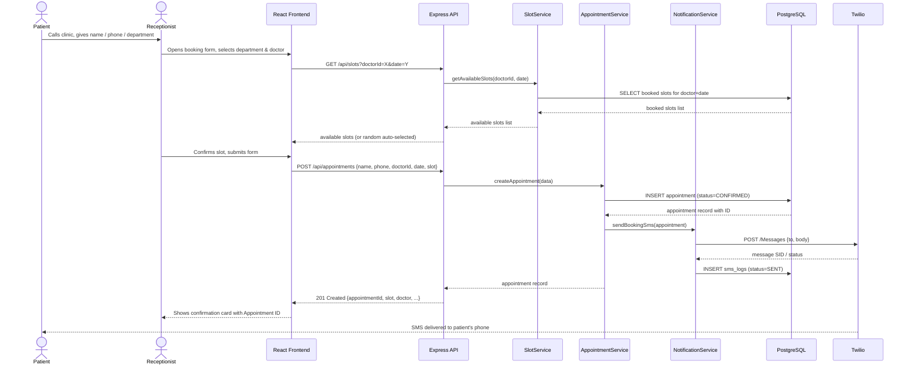
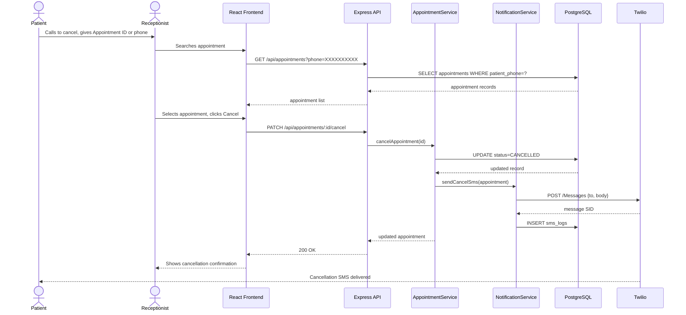
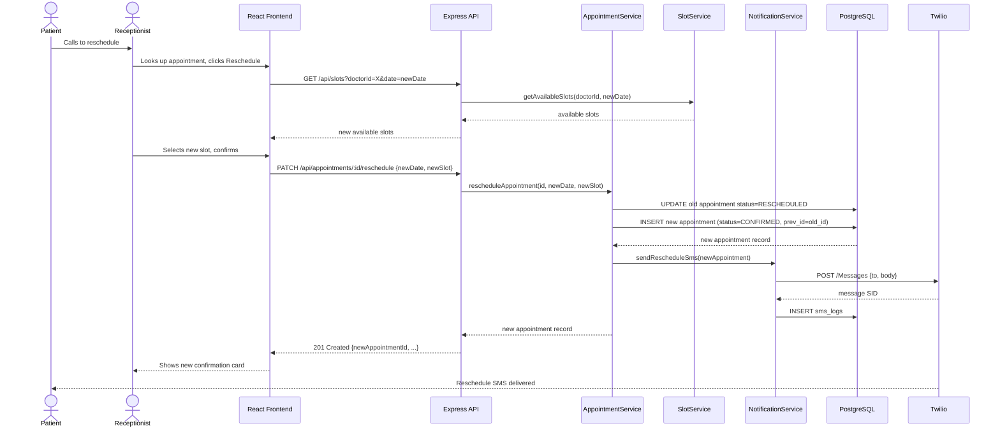
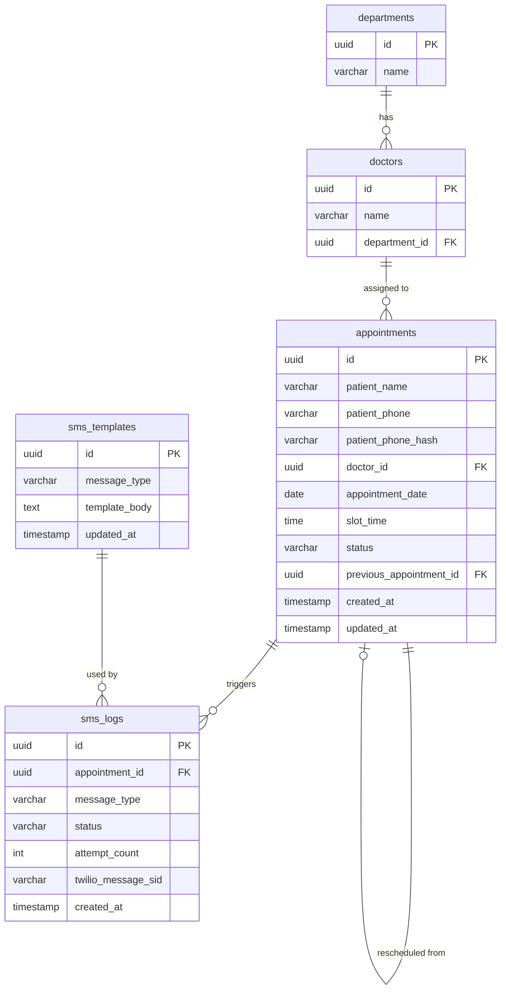

# Doctor Appointment Booking System — Architecture

**Version:** 1.0  
**Date:** 2026-09-23  
**Status:** Proposed  
**Derived from:** [requirements.md](requirements.md)

---

## 1. Architecture Pattern

The system follows a **3-Tier Client-Server** architecture:

| Tier | Role |
|---|---|
| Presentation | Browser-based React UI used by the receptionist |
| Application | REST API (Node.js / Express) containing all business logic |
| Data | PostgreSQL database for persistent storage |

An external **SMS Gateway (Twilio)** is called from the application tier for all notifications.

This pattern was chosen over microservices because:
- The load profile is low (single clinic, <10 concurrent users)
- Operational simplicity matters (NFR-07 maintainability)
- All business domains (appointments, slots, notifications) are tightly coupled

---

## 2. System Context Diagram

```
┌─────────────────────────────────────────────────────────────────────┐
│                        HealthCare Clinic                            │
│                                                                     │
│   ┌──────────────┐   calls    ┌──────────────────────────────────┐  │
│   │   Patient    │──────────▶│         Receptionist             │  │
│   │  (Phone)     │           │         (Staff)                  │  │
│   └──────────────┘           └──────────────┬───────────────────┘  │
│           ▲                                 │ uses browser          │
│           │ receives SMS                    ▼                       │
│           │                  ┌──────────────────────────────────┐  │
│           │                  │   Doctor Appointment Booking     │  │
│           │                  │   System (This Application)      │  │
│           │                  └──────────────────────────────────┘  │
│           │                                 │                       │
└───────────┼─────────────────────────────────┼───────────────────────┘
            │                                 │ SMS API calls
            │                                 ▼
            │                  ┌──────────────────────────────────┐
            └──────────────────│        Twilio SMS Gateway        │
                               │        (External Service)        │
                               └──────────────────────────────────┘
```

---

## 3. Component Diagram

```
┌────────────────────────────────────────────────────────────────────────────┐
│                          BROWSER (Receptionist)                            │
│                                                                            │
│  ┌────────────────────────────────────────────────────────────────────┐   │
│  │                    React.js Frontend                               │   │
│  │                                                                    │   │
│  │  ┌───────────────┐  ┌────────────────┐  ┌──────────────────────┐  │   │
│  │  │ BookingForm   │  │  AppointmentList│  │  CancelReschedule   │  │   │
│  │  │ Component     │  │  Component     │  │  Component          │  │   │
│  │  └───────┬───────┘  └───────┬────────┘  └──────────┬──────────┘  │   │
│  │          └──────────────────┴────────────────────── ┘             │   │
│  │                        API Client (axios)                          │   │
│  └────────────────────────────┬───────────────────────────────────── ┘   │
└───────────────────────────────┼────────────────────────────────────────── ┘
                                │ HTTPS / REST JSON
                                ▼
┌────────────────────────────────────────────────────────────────────────────┐
│                       Node.js / Express API Server                         │
│                                                                            │
│  ┌─────────────────────────────────────────────────────────────────────┐  │
│  │                           Routes Layer                              │  │
│  │   /api/appointments   /api/doctors   /api/departments  /api/slots   │  │
│  └─────────────────────────────────┬───────────────────────────────── ┘  │
│                                    │                                       │
│  ┌──────────────────┐  ┌───────────┴──────────┐  ┌────────────────────┐  │
│  │  DoctorService   │  │  AppointmentService   │  │  SlotService       │  │
│  │                  │  │                       │  │                    │  │
│  │ - listDepartments│  │ - createAppointment   │  │ - getAvailableSlots│  │
│  │ - listDoctors    │  │ - cancelAppointment   │  │ - assignRandomSlot │  │
│  │ - getDoctorById  │  │ - reschedule          │  │ - validateSlot     │  │
│  └──────────────────┘  │ - findByPhone/Id      │  └────────────────────┘  │
│                        └───────────┬──────────┘                           │
│                                    │ triggers                              │
│                        ┌───────────▼──────────┐                           │
│                        │  NotificationService  │                           │
│                        │                       │                           │
│                        │ - sendBookingSms      │                           │
│                        │ - sendCancelSms       │                           │
│                        │ - sendRescheduleSms   │                           │
│                        │ - retryOnFailure      │                           │
│                        └───────────┬──────────┘                           │
│                                    │                                       │
│  ┌─────────────────────────────────┴───────────────────────────────────┐  │
│  │                         Prisma ORM                                  │  │
│  └─────────────────────────────────┬───────────────────────────────── ┘  │
└───────────────────────────────┬────┼────────────────────────────────────── ┘
                                │    │ Twilio REST API
                                │    ▼
                                │  ┌──────────────────┐
                                │  │  Twilio SMS API  │
                                │  │  (External)      │
                                │  └──────────────────┘
                                │ SQL
                                ▼
┌────────────────────────────────────────────────────────────────────────────┐
│                           PostgreSQL Database                               │
│                                                                            │
│   departments │ doctors │ appointments │ sms_logs                          │
└────────────────────────────────────────────────────────────────────────────┘
```

---

## 4. Key Components & Responsibilities

| Component | Responsibility |
|---|---|
| **React Frontend** | Receptionist-facing UI: booking form, lookup, cancel/reschedule actions, confirmation display |
| **BookingForm** | Captures patient name, phone, department/doctor, date; calls POST /api/appointments |
| **AppointmentList** | Searches and displays appointments by phone or ID |
| **CancelReschedule** | Provides cancel and reschedule actions on a found appointment |
| **Express Routes** | HTTP routing, input validation, error response formatting |
| **AppointmentService** | Core business logic: create, cancel, reschedule appointments; enforces no-double-booking rule |
| **SlotService** | Generates the 18 daily slots per doctor, filters out booked ones, selects a random free slot |
| **DoctorService** | Returns department and doctor catalogue (seeded data) |
| **NotificationService** | Builds SMS message from `sms_templates` table, fires first Twilio call with a 2s timeout (fire-and-forget), logs outcome; background retry job retries failed sends up to 3× every 5 minutes |
| **Prisma ORM** | Type-safe database access, schema migrations |
| **PostgreSQL** | Persistent storage for appointments, doctors, departments, SMS logs |
| **Twilio SMS API** | Third-party gateway; delivers SMS to patient's phone number |

---

## 5. Technology Stack

| Layer | Technology | Version | Rationale |
|---|---|---|---|
| Frontend framework | React.js | 18.x | Widely used, component-based, fast to build forms |
| Frontend styling | Tailwind CSS | 3.x | Utility-first, minimal bundle, clean responsive UI quickly |
| HTTP client | Axios | 1.x | Promise-based, interceptors for error handling |
| Backend runtime | Node.js | 20 LTS | Same language as frontend (JS); non-blocking I/O suits API calls |
| Backend framework | Express.js | 4.x | Minimal, well-documented, large ecosystem |
| ORM | Prisma | 5.x | Type-safe queries, auto-generated migrations, good DX |
| Database | PostgreSQL | 16.x | Relational integrity for slots/appointments; strong date/time support |
| SMS Gateway | Twilio | SDK 5.x | Indian DLT-registered numbers, simple REST API, reliable delivery |
| Input validation | Zod | 3.x | Schema-based validation at API boundary |
| Logging | pino | 9.x | Structured JSON logs; `sanitize()` helper masks phone numbers before logging |
| Containerisation | Docker + Compose | latest | Reproducible dev & prod environment in one command |
| Environment config | dotenv | — | Keeps secrets out of code; integrates with Docker env vars |

---

## 6. Data Flow

### 6.1 — Book Appointment



### 6.2 — Cancel Appointment



### 6.3 — Reschedule Appointment



---

## 7. Database Schema



### Table Notes

| Table | Key Design Decisions |
|---|---|
| `appointments` | `status` enum: `CONFIRMED`, `CANCELLED`, `RESCHEDULED`. `patient_phone` stored AES-256 encrypted. `patient_phone_hash` is a SHA-256 HMAC (server-side key) used for lookup queries — solves the encrypted-column-search problem. |
| `appointments` | `previous_appointment_id` (self-referencing FK) preserves the reschedule chain for audit. Lookups return latest `CONFIRMED` in chain by default. |
| `sms_logs` | Tracks every SMS attempt. `attempt_count` supports the 3-retry NFR. `twilio_message_sid` enables delivery status lookup. |
| `sms_templates` | Seeded with booking/cancellation/reschedule templates at startup. `NotificationService` reads from here with a 5-minute in-memory TTL cache — satisfies NFR-07 (configurable without code change). |
| `doctors` | Seeded at startup via Prisma seed script; configurable without code change (NFR-07). |

### Indexes

| Index Name | Table | Columns | Type | Purpose |
|---|---|---|---|---|
| `UX_appt_slot` | `appointments` | `(doctor_id, appointment_date, slot_time)` WHERE `status='CONFIRMED'` | Unique partial | Prevents double-booking at DB level (FINDING-01) |
| `IX_appt_phone_hash` | `appointments` | `patient_phone_hash` | B-tree | Fast phone-number lookup |
| `IX_appt_doctor_date` | `appointments` | `(doctor_id, appointment_date)` | B-tree | Available-slot computation |
| `IX_sms_retry` | `sms_logs` | `status, attempt_count` | B-tree | Background retry job filter |

---

## 8. REST API Design

**Authentication** — all `/api/*` routes require a valid session cookie (httpOnly). Exceptions: `POST /api/auth/login` and `GET /health`.

| Method | Endpoint | Auth | Description |
|---|---|---|---|
| `POST` | `/api/auth/login` | Public | Receptionist login; sets httpOnly session cookie |
| `POST` | `/api/auth/logout` | Required | Invalidates session |
| `GET` | `/health` | Public | Health check with DB connectivity status |
| `GET` | `/api/departments` | Required | List all departments with their doctors |
| `GET` | `/api/doctors?departmentId=:id` | Required | List doctors for a department |
| `GET` | `/api/slots?doctorId=:id&date=:date` | Required | Get available 30-min slots for doctor on date |
| `POST` | `/api/appointments` | Required | Create a new appointment |
| `GET` | `/api/appointments/:id` | Required | Get appointment by ID |
| `GET` | `/api/appointments?phone=:phone` | Required | Search appointments by patient phone (uses HMAC hash) |
| `PATCH` | `/api/appointments/:id/cancel` | Required | Cancel an appointment |
| `PATCH` | `/api/appointments/:id/reschedule` | Required | Reschedule to a new slot |

**POST /api/appointments — Request Body**
```json
{
  "patientName": "Ravi Kumar",
  "patientPhone": "9876543210",
  "doctorId": "uuid-of-doctor",
  "appointmentDate": "2026-09-25",
  "slotTime": "14:30"
}
```

**POST /api/appointments — Response (201)**
```json
{
  "appointmentId": "uuid",
  "patientName": "Ravi Kumar",
  "doctor": "Dr. Arjun Mehta",
  "department": "Cardiology",
  "appointmentDate": "2026-09-25",
  "slotTime": "14:30",
  "status": "CONFIRMED",
  "smsStatus": "SENT"
}
```

> `smsStatus` can be `SENT`, `PENDING_RETRY`, or `FAILED`. The UI must display a warning when not `SENT`: *"Appointment confirmed. SMS could not be sent — please inform the patient verbally."*

**Standard Error Response**
```json
{
  "error": {
    "code": "SLOT_UNAVAILABLE",
    "message": "The selected slot is already booked. Please choose another time.",
    "field": "slotTime"
  }
}
```

| Error Code | HTTP | Trigger |
|---|---|---|
| `SLOT_UNAVAILABLE` | 409 | Double-booking attempt |
| `APPOINTMENT_NOT_FOUND` | 404 | ID or phone yields no record |
| `INVALID_PHONE` | 422 | Phone number fails Zod validation |
| `INVALID_DATE` | 422 | Past date or Sunday selected |
| `APPOINTMENT_ALREADY_CANCELLED` | 409 | Cancel on already-cancelled record |
| `UNAUTHORIZED` | 401 | Missing or invalid session token |

---

## 9. Deployment Architecture

### Development (Docker Compose)

```
docker-compose up
│
├── service: frontend   (React, port 3000)  — nginx serving static build
├── service: api        (Node.js, port 4000) — Express app
└── service: db         (PostgreSQL, port 5432)
```

### Production (Cloud — Recommended)

```
                    ┌──────────────┐
  Browser ─────────▶  CDN / Static │  (Vercel / S3 + CloudFront)
                    │  React Build  │
                    └──────┬───────┘
                           │ HTTPS
                    ┌──────▼───────┐
                    │  API Server  │  (App Service / Cloud Run / ECS)
                    │  Node.js     │
                    └──────┬───────┘
                   ┌───────┴──────────┐
                   ▼                  ▼
         ┌──────────────┐   ┌──────────────────┐
         │  PostgreSQL  │   │  Twilio SMS API  │
         │  (Managed DB)│   │  (External)      │
         │  RDS / Cloud │   └──────────────────┘
         │  SQL         │
         └──────────────┘
```

**Environment Variables (never committed to source control)**

| Variable | Description |
|---|---|
| `DATABASE_URL` | PostgreSQL connection string |
| `TWILIO_ACCOUNT_SID` | Twilio account identifier |
| `TWILIO_AUTH_TOKEN` | Twilio authentication token |
| `TWILIO_PHONE_NUMBER` | Twilio source phone number |
| `SESSION_SECRET` | Secret for signing session cookies |
| `RECEPTIONIST_PASSWORD_HASH` | bcrypt hash of the receptionist login password |
| `PHONE_HMAC_SECRET` | Secret key for computing `patient_phone_hash` |
| `ALLOWED_ORIGIN` | CORS allowed origin (e.g., `http://localhost:3000`) |
| `NODE_ENV` | `development` / `production` |

---

## 10. Key Architecture Decisions

### ADR-01 — Monolith over Microservices
**Decision:** Single deployable Node.js application.  
**Reason:** The system has <10 concurrent users and all domains (appointments, slots, notifications) share a database transaction boundary. Microservices would add network latency and operational overhead with no scale benefit.

### ADR-02 — PostgreSQL over NoSQL
**Decision:** PostgreSQL as the primary database.  
**Reason:** Slot booking requires strong consistency (no double-booking) and transactional guarantees. Relational queries (available slots per doctor per day) are natural SQL joins. PostgreSQL's date/time functions are a strong fit.

### ADR-03 — Fire-and-Forget SMS with Background Retry
**Decision:** The first Twilio call is dispatched within the request but not awaited for retries. The appointment is committed first; SMS is best-effort. A background polling job retries `sms_logs WHERE status='FAILED' AND attempt_count < 3` every 5 minutes.  
**Reason:** Design review (FINDING-04, FINDING-05) identified that synchronous retries would violate the 3-second booking SLA and leave appointments in an ambiguous state on SMS failure. Decoupling the booking commit from SMS delivery means a Twilio outage never blocks a valid appointment. The UI shows a warning to the receptionist when `smsStatus` is not `SENT`.

### ADR-04 — Prisma over raw SQL / Sequelize
**Decision:** Prisma as the ORM.  
**Reason:** Auto-generated, type-safe client eliminates a class of SQL injection bugs (NFR-05 data security). Prisma Migrate handles schema evolution cleanly. Easier to onboard than raw SQL for a capstone setting.

### ADR-05 — Seeded Doctor Catalogue over Admin UI
**Decision:** Doctor and department data seeded via Prisma seed script (configurable JSON), not an admin UI.  
**Reason:** Satisfies NFR-07 (configurable without code change) while keeping v1 scope tight. An admin screen is deferred to v2.

### ADR-06 — Session-Based Authentication (httpOnly Cookie)
**Decision:** Receptionist login issues an httpOnly, Secure, SameSite=Strict session cookie. All `/api/*` routes are protected by an `authenticate` middleware.  
**Reason:** Design review (FINDING-02) found no authentication in the original design — a security violation of NFR-05 and DPDP Act 2023. Session cookies are preferred over `Authorization` headers for browser clients because httpOnly prevents XSS token theft. A single receptionist account (v1) avoids a full user management system while still securing patient data.

### ADR-07 — HMAC Hash Column for Encrypted Phone Lookup
**Decision:** Store `patient_phone` as AES-256 encrypted ciphertext and a separate `patient_phone_hash` column as SHA-256 HMAC(plaintext, PHONE_HMAC_SECRET). Lookups query on the hash column.  
**Reason:** Design review (FINDING-03) identified that AES-256 encrypted columns cannot be searched with SQL equality. Deterministic encryption weakens security. The HMAC approach maintains searchability while preserving strong encryption for the stored value. The HMAC key must be rotated with a full re-hash migration if compromised.

---

## 11. Security Considerations

| Concern | Mitigation |
|---|---|
| Patient phone number exposure | `patient_phone` stored AES-256 encrypted; `patient_phone_hash` (HMAC) used for lookup; phone masked (`98****3210`) in all application logs via `pino` + `sanitize()` helper |
| SQL injection | Prisma parameterised queries; no raw SQL in application code |
| Unauthorised API access | Session-based auth (httpOnly cookie); all `/api/*` routes protected; `authenticate` middleware on every route |
| API abuse | `express-rate-limit` on all booking and lookup endpoints; unauthenticated rate limit on `/api/auth/login` |
| Transport security | HTTPS enforced; HTTP redirected; TLS 1.2+ minimum; CORS locked to `ALLOWED_ORIGIN` env var |
| Secret management | All credentials via environment variables; never in source code |
| DPDP Act 2023 | Phone number shared only with Twilio for SMS delivery; no analytics or third-party sharing |
| Double-booking | Partial unique index `UX_appt_slot` + serialisable transaction enforces slot uniqueness at DB level |
